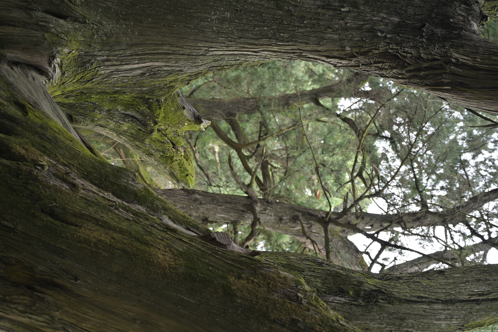

{width=250px}

this is milestone 2 of DSCI_521 course

**Sicong Deng**

I come from China, and this is my first time in Vancouver and Canada.

I had a Bachelor major in literature and a minor in software engineering. I just finished my undergraduate, and I hope to learn more about LLM, including training and fine-turing, and other general knowledges of data science. After finishing the program, I just hope to find a local job and try not to starve.
